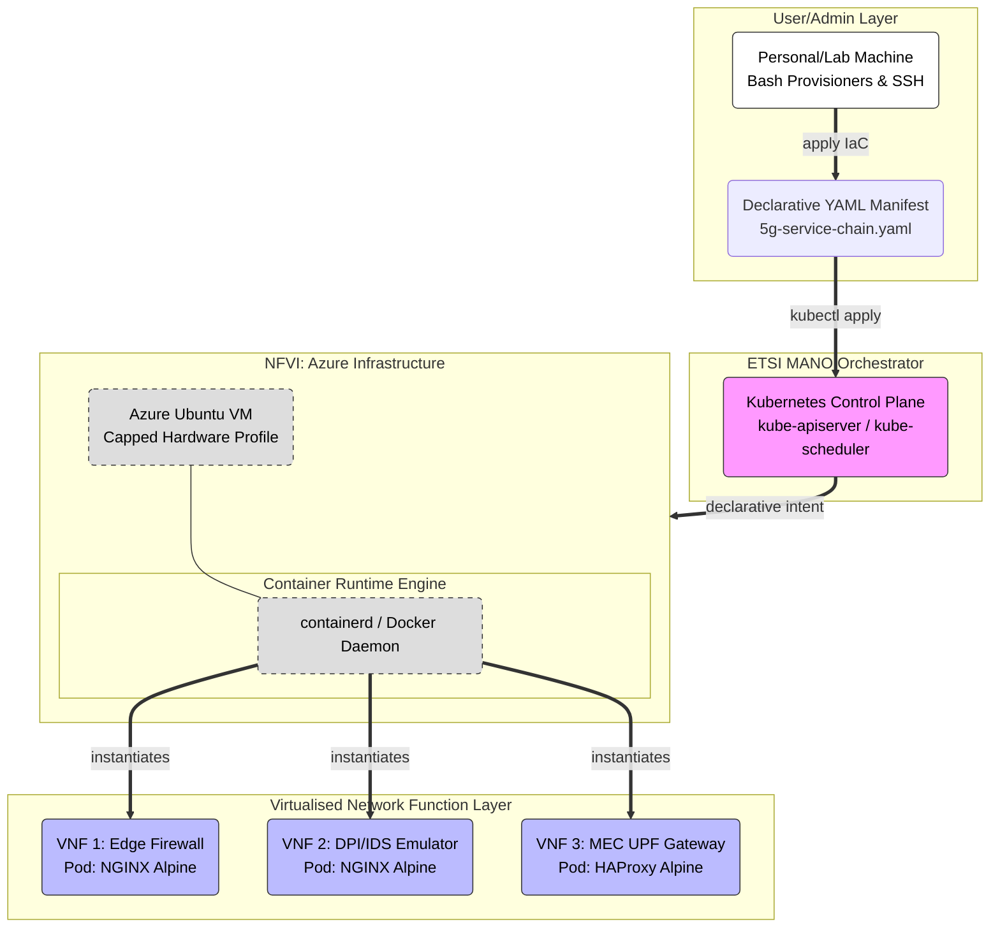
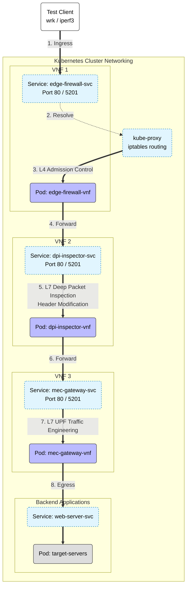

# 5G Edge Network Functions Virtualisation (NFV) Orchestration

This repository contains the infrastructure automation scripts and Kubernetes manifests required to deploy and evaluate a 5G Service Function Chain (SFC) across simulated Cloud and Edge environments.

This project explores the performance implications of ETSI MANO orchestration by benchmarking a traditional Cloud environment (Minikube/Docker) against a resource-constrained Multi-Access Edge Computing (MEC) node (K3s/containerd).

## 🏗️ Architecture Overview

The architecture emulates a **Zero-Trust 5G Network Slice** using lightweight, container-native proxies. It consists of three sequentially deployed Virtualised Network Functions (VNFs):

1. **VNF 1 (Edge Security Firewall):** An NGINX proxy providing Layer 4/7 admission control at the network boundary.
2. **VNF 2 (DPI / IDS Emulator):** An NGINX node simulating Lawful Interception by actively unboxing, inspecting, and injecting security headers (`X-DPI-Inspected`) into HTTP payloads.
3. **VNF 3 (MEC UPF Gateway):** A high-concurrency HAProxy acting as the User Plane Function (UPF) to load-balance traffic to target applications.

By comparing the deployment of this SFC on both a heavy Cloud orchestrator and a lightweight Edge orchestrator, this project empirically evaluates TCP throughput, HTTP latency, and container runtime efficiency.

### 1. ETSI MANO Implementation Diagram

This diagram illustrates the theoretical ETSI MANO layers mapped to the project's practical Azure and Kubernetes infrastructure.



### 2. Service Function Chain (SFC) Data Plane

This diagram visualizes the active data flow and traffic routing through the Virtualised Network Functions during experimental load testing.



## 📂 Repository Structure & File Placements

The files in this repository are designed to be distributed across your local machine and the respective Azure Virtual Machines.

### 1. Local Machine (The Control Node)

These files remain on your local machine to manage remote access and version control:
* `connect.sh`: An interactive SSH manager with environment variable loading.
* `.env`: Template for SSH configurations (IPs, Usernames, Passwords).

### 2. Azure Cloud VM (`vm-ab`)

These files must be copied to the Cloud Server VM (Ubuntu 22.04 LTS):
* `bootstrap-cloud.sh`: The master orchestration script to install Minikube, Docker, Prometheus, Grafana, and deploy the SFC.
* `5g-service-chain.yaml`: The declarative Kubernetes manifest defining the VNFs.

### 3. Azure Edge VM (`vm-edge`)

These files must be copied to the Edge Client VM (Ubuntu 22.04 LTS):
* `bootstrap-edge.sh`: The master orchestration script to install K3s, Node Exporter, and deploy the SFC.
* `5g-service-chain.yaml`: The identical Kubernetes manifest for a 1:1 performance comparison.

*(Note: `.pem` SSH keys and local `.env` files are strictly ignored via `.gitignore` for security).*

## 🚀 Azure Infrastructure Setup

Before running the scripts, you must manually provision two Virtual Machines in Microsoft Azure:

1. **Cloud VM:** Standard_B2s (2 vCPUs, 4 GiB memory).
2. **Edge VM:** Standard_B1s (1 vCPU, 1 GiB memory) to simulate a constrained IoT/MEC device (e.g., Raspberry Pi) or Standard_B2s if unavailable.

**Network Security Group (NSG) Requirements:**
Ensure the following inbound port rules are configured on the VMs:
* `22` (SSH) - Restricted to your current Public IP.
* `80` (HTTP) - For `wrk` load testing.
* `5201` (TCP) - For `iperf3` bandwidth testing.
* `9090` & `3000` (Cloud VM Only) - For Prometheus and Grafana Web UIs.
* `9100` (Edge VM Only) - To allow the Cloud Prometheus server to scrape Edge hardware metrics.

## 💻 Usage Instructions

### Step 1: Local SSH Setup

1. Clone this repository to your local machine.
2. Place your Azure `.pem` key files into the root directory.
3. Copy the environment template and fill in your specific Azure details:
  ```text
  AZURE_USER=
  CLOUD_VM_IP=
  CLOUD_KEY_FILE=
  EDGE_VM_IP=
  EDGE_KEY_FILE=
  GRAFANA_PASS=
  ```
4. Run the SSH manager to connect to your VMs:
   ```bash
   ./connect.sh
   ```

### Step 2: Environment Orchestration

SSH into your respective VMs, copy and then execute the master scripts. The scripts feature interactive menus guiding you through Task B (Infrastructure Setup), Task C (Deployment), and Task D (Load Testing).

*(Note: run the scripts as `sudo` to avoid any permission issues).*

**On the Cloud VM:**
```bash
# Make executable
chmod +x bootstrap-cloud.sh
sudo ./bootstrap-cloud.sh
```

**On the Edge VM:**
```bash
# Make executable
chmod +x bootstrap-edge.sh
sudo ./bootstrap-edge.sh
```

### Step 3: Experimental Load Testing

Once the environments are deployed (Option 05 in the scripts), utilise Option 06 to run the automated test suite. This uses `kubectl run` to generate ephemeral testing pods directly inside the clusters:
* **ICMP Ping:** Establishes baseline orchestration latency.
* **iperf3:** Floods the SFC with TCP packets to identify virtual network bandwidth ceilings.
* **wrk:** Simulates 100 concurrent HTTP users to evaluate Layer 7 Deep Packet Inspection overhead.

*Functional validations, such as Chaos Engineering (Pod assassination) and Negative Security (Unauthorized port blocking), are also integrated into the testing menu.*
