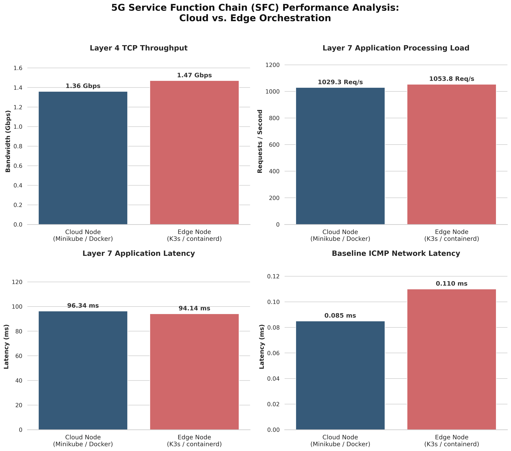
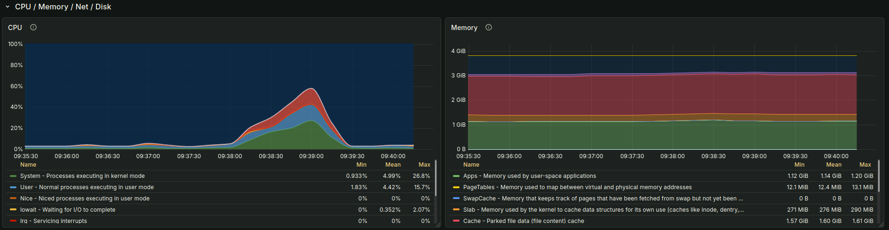
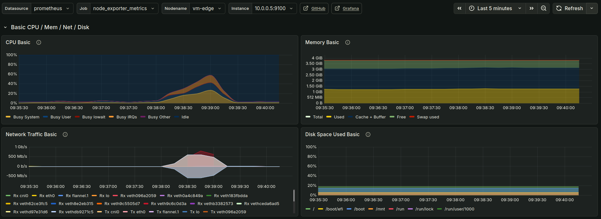
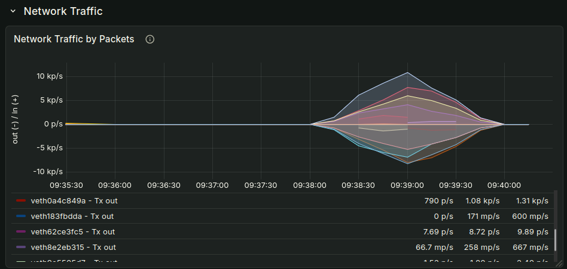
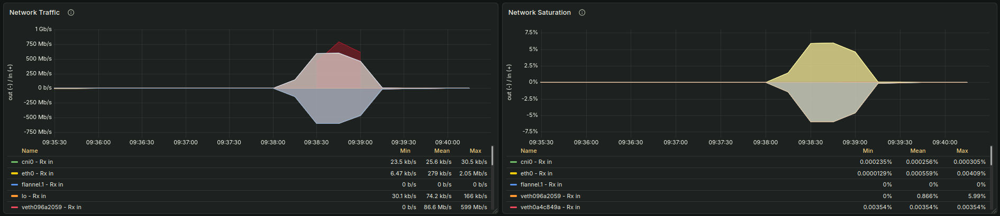

# Task E / Q5

## Results

### Tablularised Data

| Performance Metric          | Cloud VM (Minikube / Docker) | Edge VM (K3s / containerd) | Advantage |
| :-------------------------- | :--------------------------- | :------------------------- | :-------- |
| **Hardware Specs**          | 2 vCPU, 4GB RAM              | 2 vCPU, 4GB RAM            | -         |
| **Baseline Latency (Ping)** | 0.085 ms                     | 0.110 ms                   | Cloud     |
| **TCP Throughput (iperf3)** | 1.36 Gbits/sec               | 1.47 Gbits/sec             | Edge      |
| **HTTP Load (wrk)**         | 1029.30 Req/sec              | 1053.75 Req/sec            | Edge      |
| **HTTP Latency (wrk)**      | 96.34 ms                     | 94.14 ms                   | Edge      |

---

### Grafana and Performance Graphs

*Figure 1: Comparative performance analysis of the 3-VNF Service Function Chain across Cloud and Edge orchestrators.*

*Figure 2: Edge node hardware telemetry during the 30-second wrk load simulation. Note the static memory footprint and the division of CPU kernel (System) vs. application (User) processing.*

## Discussion

To ensure a rigorous comparative analysis, both the Cloud (Minikube/Docker) and Edge (K3s/containerd) environments were provisioned with identical hardware configurations (4GB RAM, 2 vCPU). By controlling the hardware variable, performance deltas observed during testing can be directly attributable to orchestration and container runtime overhead.

Despite identical configurations, the lightweight Edge environment consistently outperformed the heavy Cloud node under sustained load (Figure 1). The K3s environment achieved a higher Layer 4 TCP bandwidth ceiling (1.47 Gbps vs. 1.36 Gbps) and superior Layer 7 HTTP processing capacity (1053.75 Req/sec vs. 1029.30 Req/sec) with lower average application latency (94.14ms vs. 96.34ms). The Cloud node possessed only a marginal advantage in baseline ICMP latency (0.085ms vs. 0.110ms), indicating that while Minikube routes idle packets efficiently, the containerd runtime scales significantly better under high-concurrency 5G traffic.

Resource telemetry provided deep visibility into this efficiency (Figure 2). During the 100-user wrk load simulation, the Edge VM's memory consumption flatlined at approximately 41.2% (~1.6GB) of its 4GB total. This demonstrates that the NGINX and HAProxy microservices require near-zero dynamic memory allocation. Conversely, Minikube's Docker daemon introduced substantial baseline memory bloat. Furthermore, CPU telemetry cleanly divided the processing load into 'System' and 'User' utilisation. The significant 'System' CPU spike during the wrk test helps visualise the computational tax of traversing the Linux kernel and kube-proxy iptables for internal Service Function Chain (SFC) routing.

Deployment complexity was identical; Kubernetes' declarative abstraction allowed the same YAML manifest to seamlessly provision both architectures, proving that Zero-Touch Slicing-as-a-Service (SlaaS) is highly portable. Kubernetes offers robust lifecycle management; demonstrated by instant ReplicaSet self-healing during pod termination but default networking remains a bottleneck for deep SFCs. To enhance ultra-low latency User Plane Functions (UPF), future edge architectures must bypass the kernel entirely by integrating Single Root I/O Virtualisation (SR-IOV) or the Data Plane Development Kit (DPDK).

These findings strongly align with current literature. The data validates Carrión’s (2022) assertions regarding orchestration taxonomy, proving that shedding heavy control-plane bloat is mandatory for Multi-Access Edge Computing (MEC) optimisation, making edge deployment highly feasible and efficient. Furthermore, it reinforces Paolucci et al.’s (2021) conclusion that deploying decoupled, programmable data planes at the network edge achieves low latency when utilising optimised microservices.

*(Note: Supplementary visual telemetry confirming internal virtual interface routing and disk I/O efficiency is available in Appendix A).*

## References

F. Paolucci, et al. 2021. Enhancing 5G SDN/NFV Edge with P4 Data Plane Programmability. IEEE Network, vol. 35, no. 3, pp. 154-160, https://doi.org/10.1109/MNET.021.1900599.

Carmen Carrión. 2022. Kubernetes Scheduling: Taxonomy, Ongoing Issues and Challenges. ACM Comput. Surv. 55, 7, Article 138 (July 2023), 37 pages. https://doi.org/10.1145/3539606

## Appendix A: Supplementary Telemetry Data

**Figure A1: Comprehensive hardware telemetry for the Edge VM (K3s) during the 30-second Layer 7 load simulation.**

> *This consolidated view illustrates the holistic impact of the 100-user `wrk` test. It visually correlates the direct relationship between the sudden surge in ingress/egress network traffic (bottom left) and the corresponding CPU processing spike (top left). Notably, both Memory allocation and Disk space remain entirely static, demonstrating the lightweight nature of the deployed containerised VNFs.*

**Figure A2: Packet-level network traffic analysis isolating virtual interface activity on the Edge node.**

> *This graph details the packets-per-second (p/s) flow across multiple virtual ethernet (`veth`) interfaces. The simultaneous, mirrored spikes across these distinct interfaces visually represent the internal Kubernetes Service Graph actively routing the simulated 5G traffic through the sequential 3-VNF pipeline (Firewall $\rightarrow$ DPI $\rightarrow$ UPF Gateway).*

**Figure A3: Comparative analysis of Network Saturation versus Disk I/O on the Edge node.**

> *These metrics confirm the anticipated resource distribution for a Network Functions Virtualisation (NFV) architecture. While network bandwidth and interface saturation spike significantly to accommodate the simulated HTTP payload inspection, disk throughput and IOPs (Input/Output Operations Per Second) remain practically at zero. This proves the Layer 7 Deep Packet Inspection occurs entirely in-memory without relying on disk-based swap space.*
